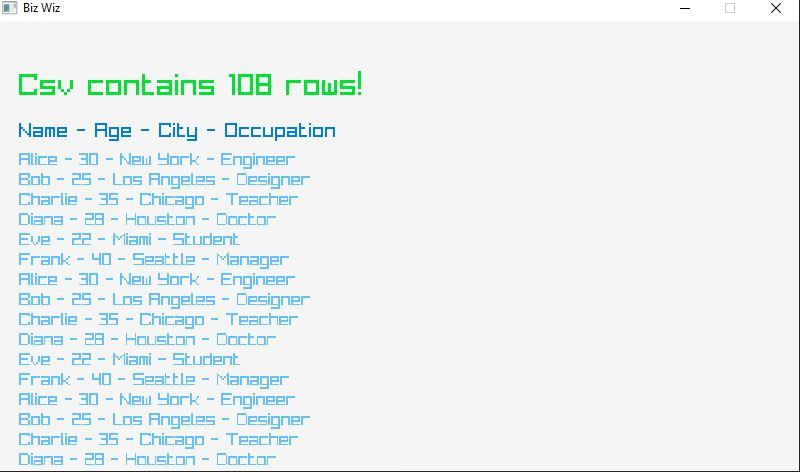

# Biz Wiz - Visualization of csv files.
the future of business...

The web version of the program can be seen here. https://people.cs.umu.se/oi17okf/

## Dependencies
This program uses the library raylib for rendering. You will have to download and install it manually here (then set the makefil paths correctly). https://github.com/raysan5/raylib/

This program uses emscripten for web compilation. If you wish to compile to the web you will need to download it. https://emscripten.org/

This program uses tinyxml2, but since it's included you do not have to do anything.

## Compile & Run
All instructions assume windows (for now). 

To compile for desktop, run `make`. This generates `desktop.exe`.

To compile for web, run `make web`, This generates the a bunch of index files. 
To launch the program run the command `emrun --no_browser --port 8080 .` 
Then open `http://localhost:8080/index.html` in your browser.

Then just run a.exe and a windows should appear like this!  

The readme will be expanded when the program actually does something...!
